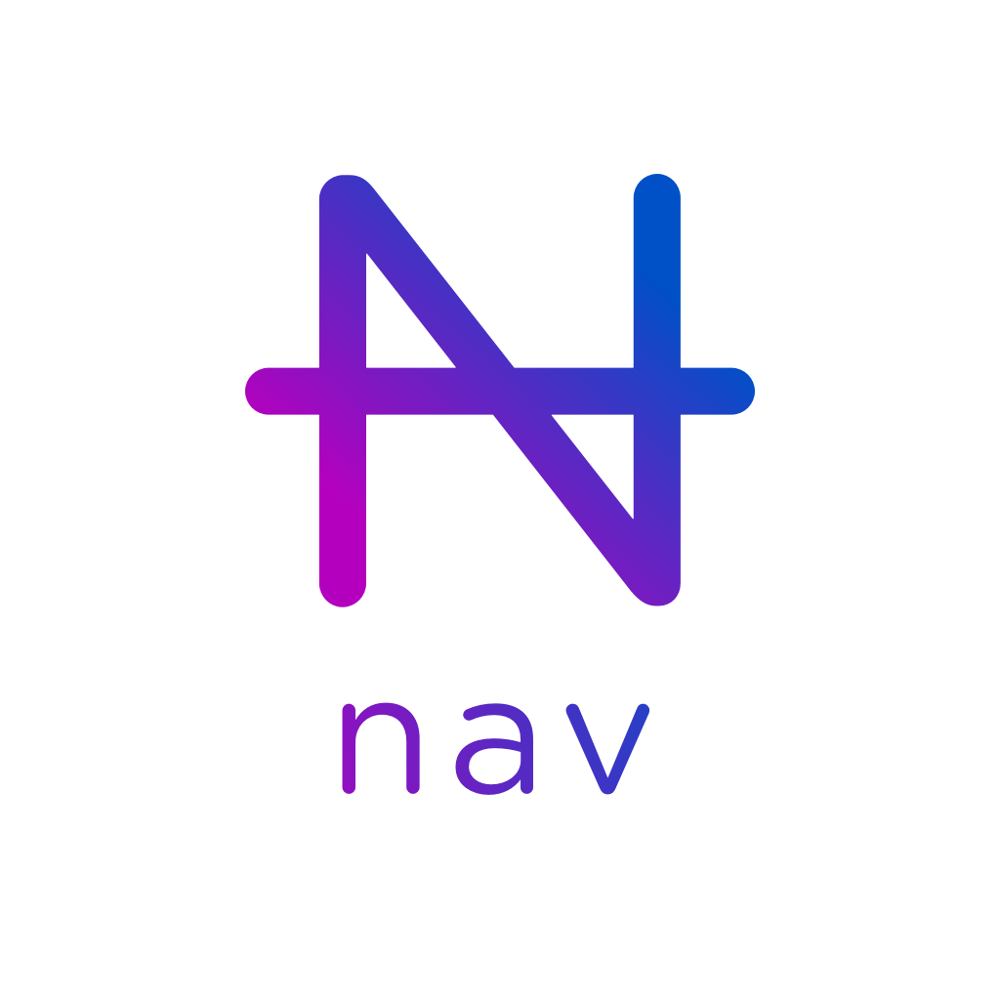
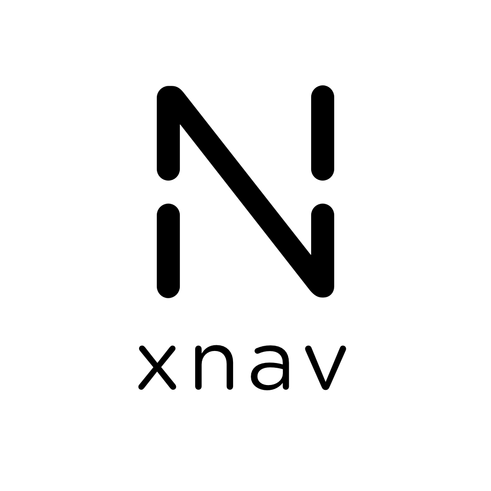

# Proposed assets for NavCoin (by anquii) 
In this repository, one can find the proposed assets (by anquii) for new logos to be used as part of the NavCoin project. The proposed assets for nav and xnav are intended to be viewed as logos for each of the currencies that they represent. In addition to this, the proposed logo for nav is also intended to be used as the official logo for the NavCoin project as a whole. The nav logo is simply the letter N with a strikethrough, enabling one to read the letters N, A and V. For xnav, the strikethrough has been removed, causing a hole on both sides of the N, to symbolise breaking the link between the sender and the receiver of a transaction.

As part of the git directory, one can also find the above logos without the added text, or as variations where the context may differ (e.g. depending on the background being light, dark or colored). A few [marketing graphics](nav/icon-in-action) can also be found, where one can see the nav logo in use.
